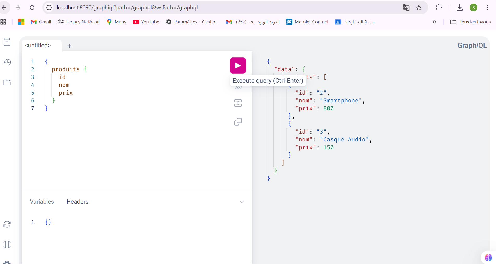
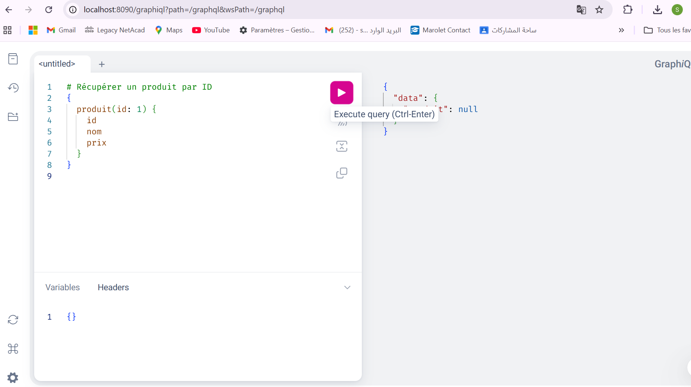
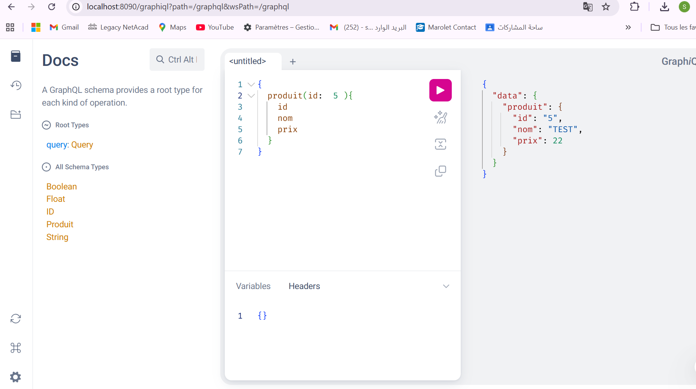

TP1 GraphQL Spring Boot
Ce projet est un petit service GraphQL en Java Spring Boot qui permet de gérer des produits (ajout, consultation, recherche).

📁 Structure du projet
model/ : contient la classe Produit

repository/ : accès aux données (ProduitRepository)

service/ : logique métier (ProduitService)

graphql/ : expose les queries GraphQL (ProduitController)

resources/graphql/ : schéma GraphQL schema.graphqls

resources/images/ : captures d'écran de tests GraphQL dans graphiql

🚀 Queries GraphQL
produits → retourne la liste des produits

produit(id: ID!) → retourne un produit spécifique par ID

produitsParNom(q: String!) → recherche de produits par mot-clé dans le nom

🧰 Technologies
Java 17+

Spring Boot

Spring Data JPA

Spring for GraphQL

H2 Database

Maven

📸 Captures d’écran
Exemple d’utilisation et résultat de requêtes via GraphiQL :

## Auteur
- 👩‍💻 Salma SBA

